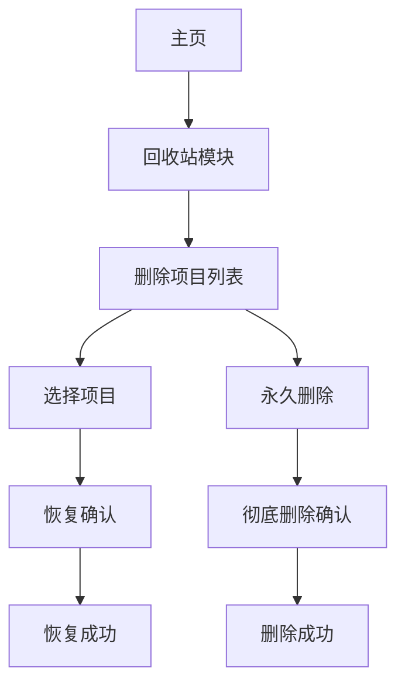

## 1. 产品概述
在工时管理系统主页新增回收站模块，用于存储被删除的工时记录和工序，并提供恢复功能，防止因误删导致数据永久丢失，保障数据安全性和完整性。

## 2. 核心功能

### 2.1 用户角色
| 角色 | 注册方式 | 核心权限 |
|------|----------|----------|
| 普通员工 | 邮箱注册 | 查看和恢复自己删除的工时记录 |
| 管理员 | 管理员分配 | 查看和恢复所有用户删除的工时记录和工序 |

### 2.2 功能模块
回收站模块包含以下核心页面：
1. **回收站主页**：显示所有已删除的工时记录和工序列表
2. **详情查看页**：展示单个删除项目的详细信息

### 2.3 页面详情
| 页面名称 | 模块名称 | 功能描述 |
|----------|----------|----------|
| 回收站主页 | 删除项目列表 | 以表格形式展示被删除的工时记录和工序，包含删除时间、删除人、项目类型等关键信息 |
| 回收站主页 | 搜索筛选 | 支持按项目类型、删除时间范围、删除人进行筛选，支持关键词搜索 |
| 回收站主页 | 批量操作 | 支持批量选择和恢复多个项目，或批量永久删除 |
| 回收站主页 | 恢复确认 | 点击恢复按钮后弹出确认对话框，防止误操作 |
| 详情查看页 | 项目详情 | 展示被删除项目的完整信息，包括原始内容和删除相关信息 |
| 详情查看页 | 恢复操作 | 提供恢复按钮，将项目恢复到原始位置 |
| 详情查看页 | 永久删除 | 提供永久删除按钮，彻底删除项目且不可恢复 |

## 3. 核心流程

### 用户操作流程
1. 用户进入回收站主页
2. 浏览或搜索需要恢复的删除项目
3. 选择单个或多个项目进行恢复
4. 确认恢复操作
5. 项目成功恢复到原始位置

### 管理员流程
管理员可以查看和恢复所有用户的删除项目，流程与普通用户类似但权限更广。

## 4. 用户界面设计

### 4.1 设计风格
- **主色调**：深蓝色 (#1E3A8A) 配合白色背景
- **按钮样式**：圆角矩形，主要操作为实心按钮，次要操作为边框按钮
- **字体**：系统默认字体，标题16px，正文14px
- **布局风格**：卡片式布局，顶部导航栏固定
- **图标风格**：使用简洁的线性图标，恢复操作用还原箭头图标

### 4.2 页面设计概览
| 页面名称 | 模块名称 | UI元素 |
|----------|----------|--------|
| 回收站主页 | 删除项目列表 | 表格展示，每行显示项目类型、名称、删除时间、删除人，操作列包含恢复和永久删除按钮 |
| 回收站主页 | 搜索筛选 | 顶部搜索框，左侧筛选下拉菜单，支持多条件组合筛选 |
| 回收站主页 | 批量操作 | 表格顶部显示批量操作栏，包含全选复选框、批量恢复、批量删除按钮 |
| 详情查看页 | 项目详情 | 卡片式布局展示项目完整信息，底部显示操作按钮 |

### 4.3 响应式设计
采用桌面端优先设计，适配不同屏幕尺寸：
- 桌面端：完整表格展示，支持复杂筛选
- 平板端：简化表格，保留核心信息
- 移动端：卡片式列表，重要操作前置

### 4.4 交互设计
- 删除项目默认保留30天，过期自动清理
- 恢复操作需要二次确认，防止误操作
- 批量操作提供进度提示
- 永久删除操作需要管理员权限确认